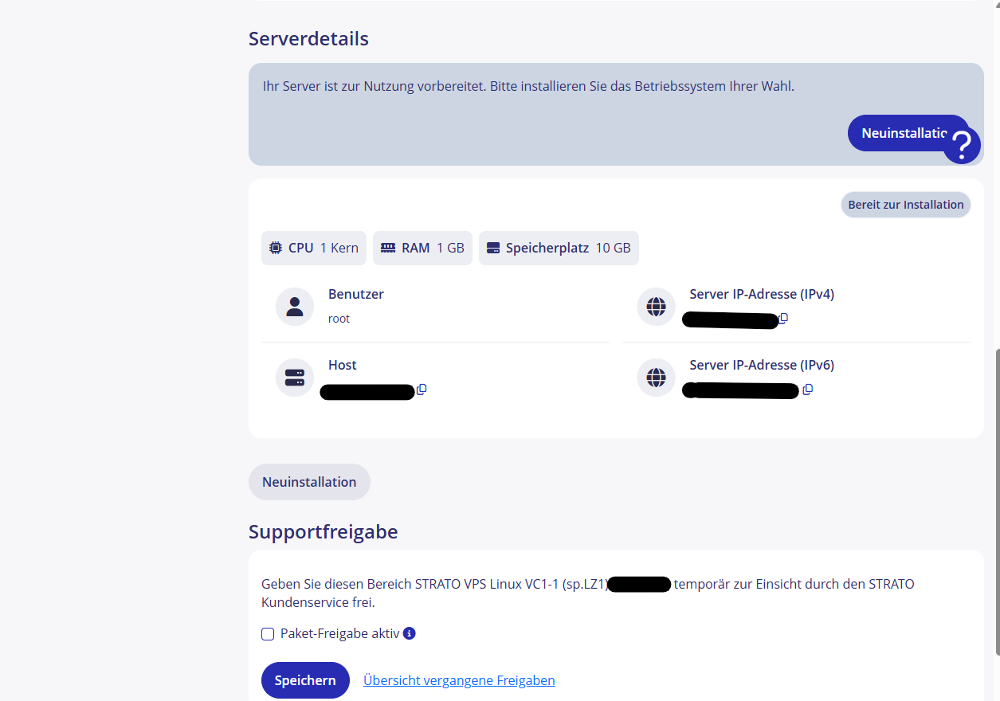

##### 1. Ubuntu Server installation as VPS:
- Server specification:  1 CPU ; 1 GB RAM ; 10 GB STORAGE <br>
<a href="./assets/vps.png" style="display: inline-block; margin-right: 15px;"> </a><a href="./assets/vps.png" style="display: inline-block; margin-right: 15px;"> </a>

##### 2.Create ssh keys and connecting to the server:
- use the command to create keys: 
```powershell
  ssh-keygen -f FILENAME
  ```

| Parameters 🔑 | Description 📝                     |
| :-----------: | ---------------------------------- |
|      -f       | allows you to choose your own name |
- command creates private and public keys in the .ssh folder:
<div align="center">C:\Users\USERNAME\.ssh</div>